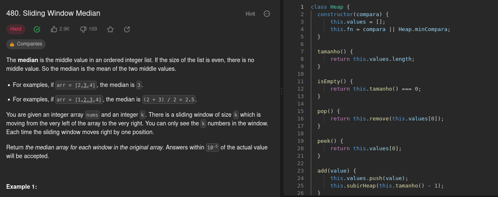
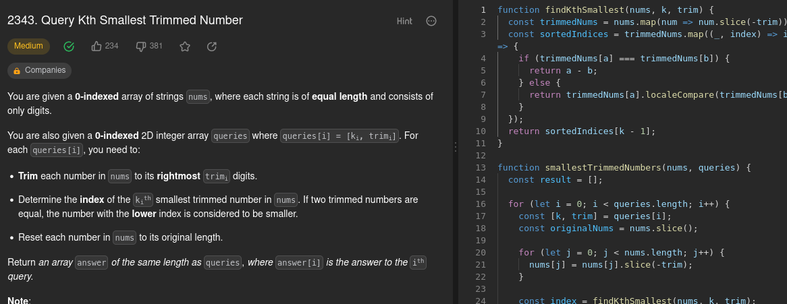

# D-C_Exercicios_Dupla35

**Número da Lista**: 4 
**Conteúdo da Disciplina**: D&C 

## Alunos
|Matrícula | Aluno |
| -- | -- |
| 20/0023411  |  Luíza Esteves dos Santos |
| 20/0026551  |  Rafael Xavier Canabrava |

## Sobre 
Exercícios relacionados aos assuntos abordados na disciplina no módulo de Dividir e Conquistar utilizando os algoritmos passados em aula

## Screenshots

## Instalação 
**Linguagem**: Javascript 
É necessário ter o NodeJs instalado para execução

## Outros 
Dentro da pasta do exercício execute o arquivo com o seguinte comando: **node arquivo.js**

